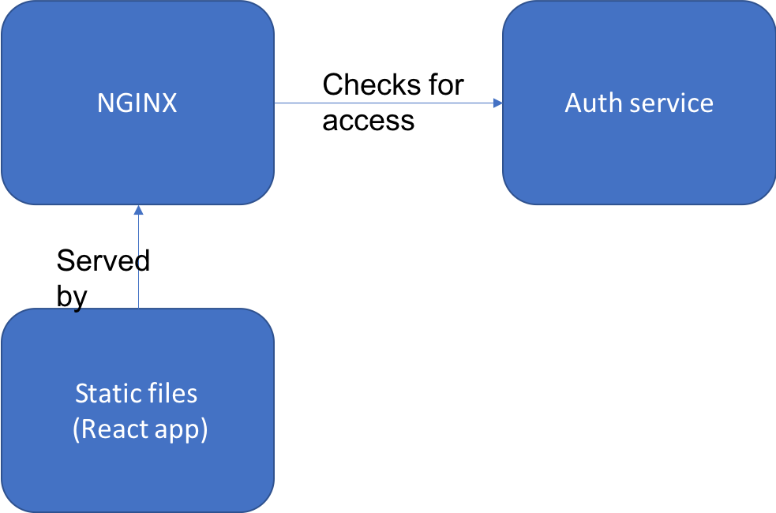

# Securing backend access and reverse proxying

This example creates a backend with simple auth end point which passes a signed JWT to the backend to validate the call to the backend. This creates trust inside the network of the application. The backend is also in the same proxy as the front end avoiding CORs related issues.

## Running

To run:
`docker-compose up`

## Notes

* The base docker image for nginx requires to run as root, that is why the `bitnami/nginx` image is instead used.
* Multistage builds enable the react app to be built in the image and only the static files copied across to the final image.
* NGINX provides compression and in memory cache for faster application load times.
* Proxying authorisation of requests can be split out from application ([docs](https://docs.nginx.com/nginx/admin-guide/security-controls/configuring-subrequest-authentication/)).
* JWT provide a means of validating requests betwee components in the system.