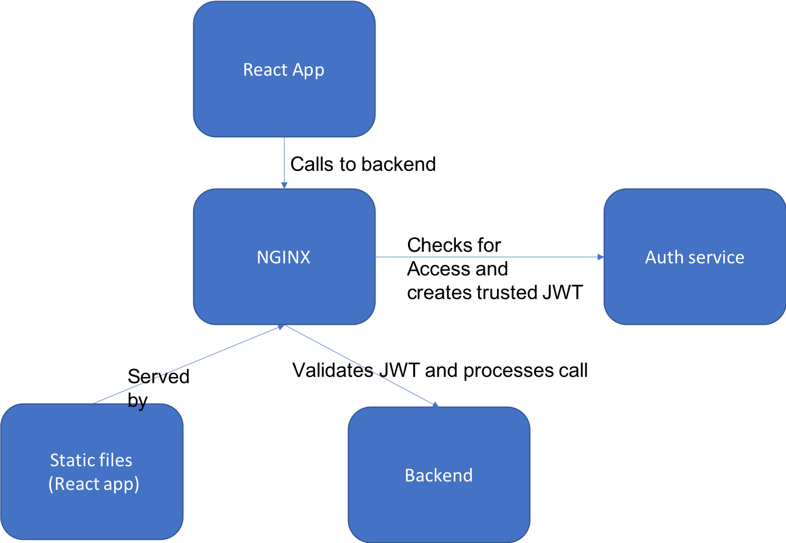

# Authorising access to a static app

This example creates a simple auth end point which randomly decides if someone should have access to the webapp.

## Running

To run:
`docker-compose up`

## Notes

* The base docker image for nginx requires to run as root, that is why the `bitnami/nginx` image is instead used.
* Multistage builds enable the react app to be built in the image and only the static files copied across to the final image.
* NGINX provides compression and in memory cache for faster application load times.
* Proxying authorisation of requests can be split out from application ([docs](https://docs.nginx.com/nginx/admin-guide/security-controls/configuring-subrequest-authentication/)).